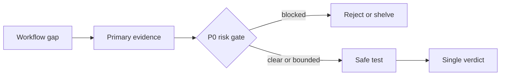

# APEX Tool Evaluator

[](https://github.com/zltstl888/apex-tool-evaluator/actions/workflows/validate.yml)
[](https://github.com/zltstl888/apex-tool-evaluator/releases/latest)
[](LICENSE)

An evidence-led Agent Skill that turns tool hype into one auditable adoption decision.

**Evidence before adoption.** Evaluate Agent Skills, MCP servers, APIs, CLIs, SaaS products, browser extensions, repositories, models, and datasets against a real workflow, primary evidence, risk gates, cost, and a bounded test.

## Quick start

Install the tagged release with the open-source [`skills`](https://github.com/vercel-labs/skills) CLI:

```bash
npx skills add \
  https://github.com/zltstl888/apex-tool-evaluator/tree/v0.1.1 \
  --skill apex-tool-evaluator
```

Or clone the same release into a project-local Agent Skills directory:

```bash
mkdir -p .agents/skills
git clone --branch v0.1.1 --depth 1 \
  https://github.com/zltstl888/apex-tool-evaluator.git \
  .agents/skills/apex-tool-evaluator
```

The required entry point is [`SKILL.md`](SKILL.md). The `main` branch is the development channel; stable installations should use a tagged release.

## What it returns

- the workflow gap and current baseline;
- primary evidence and facts that remain unverified;
- P0 risk gates for license, data, permissions, cost, and side effects;
- a 0–5 evidence-backed scorecard when the evidence supports one;
- a bounded test with success criteria and rollback;
- one adoption verdict.

## A 30-second example

**Request**

> Evaluate an open-source MCP server for internal support. It asks for read/write access to Slack and Google Drive. Do not install or authorize anything.

**Decision shape**

```text
Verdict: shelved_pending_authorization

Blocked: candidate identity, license, security evidence, and exact OAuth scopes
Preserve: current read-only connector
Next safe step: verify primary sources, then test a local mock with synthetic data
Authority: no installation, OAuth grant, payment, or production change
```

The Skill does not invent missing evidence or turn a score of zero into a factual claim.

## Decision path



## Common use cases

- assess a high-permission connector without granting real access;
- classify overlapping Agent Skills as mainline, auxiliary, fallback, or reference;
- verify live pricing, privacy, license, and maintenance evidence;
- reject the framework when the request is an ordinary consumer comparison.

See [`examples/README.md`](examples/README.md) for three compact examples covering normal, edge, and out-of-scope behavior.

## Why it exists

Tool discovery is easy. Tool adoption is expensive.

An impressive demo can still duplicate an existing workflow, lack a usable license, expose company data, create unbounded cost, or fail under normal operation. This Skill converts a recommendation into a traceable decision with explicit evidence, risk boundaries, and a reversible next step.

When core identifiers are missing, it intentionally returns a short intake decision instead of filling a large scorecard with guessed zeroes. Full reports are reserved for identifiable or high-risk decisions.

## Verdicts

`mainline_candidate`, `auxiliary_candidate`, `test_first`, `observe_only`, `reference_only`, `shelved_pending_authorization`, or `reject`.

No verdict authorizes installation, payment, authentication, production changes, or access grants by itself.

## Example prompt

```text
We are considering a GitHub-hosted MCP server for an internal support workflow.
It asks for read/write access to Slack and Google Drive. Compare it with our
current read-only connector, verify the license and maintenance status, and
propose a synthetic-data test. Do not install or authorize anything.
```

## Repository layout

```text
SKILL.md                        Agent instructions
examples/README.md             Compact behavior examples
references/evaluation-form.md  Durable decision template
evals/evals.json               Normal, edge, and negative fixtures
scripts/validate_skill.py      Structure and public-boundary linter
tests/test_validate_skill.py   Validator regression tests
PROVENANCE.md                  Authorship and origin record
THIRD_PARTY_NOTICES.md         External names and bundled-code boundary
SECURITY.md                    Vulnerability reporting guidance
```

## 中文快速开始

这是一个面向企业 AI 工具治理的通用 Skill。它不会因为工具热门就建议接入，而是先回答：解决什么真实流程、是否重复、证据是否可信、数据和权限是否安全、能否用合成数据小范围验证。

```bash
npx skills add \
  https://github.com/zltstl888/apex-tool-evaluator/tree/v0.1.1 \
  --skill apex-tool-evaluator
```

适合评估 Agent Skill、MCP Server、API、CLI、SaaS、浏览器扩展、GitHub 仓库、模型和数据集。普通消费品比较不适用。

公开版本不包含客户资料、本机路径、账号凭证、内部工具库存或生产状态。

## Feedback

- Ask usage questions or share an adoption story in [Discussions](https://github.com/zltstl888/apex-tool-evaluator/discussions).
- Suggest a public or synthetic eval through the [Evaluation Request template](https://github.com/zltstl888/apex-tool-evaluator/issues/new?template=evaluation-request.yml).
- Report reproducible decision behavior through the [Behavior Report template](https://github.com/zltstl888/apex-tool-evaluator/issues/new?template=behavior-report.yml).
- Report linter, test, CI, or package-validation problems through the [Validator Report template](https://github.com/zltstl888/apex-tool-evaluator/issues/new?template=validator-report.yml).
- Report security problems according to [`SECURITY.md`](SECURITY.md).

## Development

Validation tooling requires Python 3.12 or later.

```bash
python3 -m pip install \
  "git+https://github.com/agentskills/agentskills.git@69ef37e9424c0a7ea9dd2293b559e43ec8176379#subdirectory=skills-ref"
skills-ref validate "$PWD"
python3 scripts/validate_skill.py
python3 -B -m unittest discover -s tests -v
```

The linter catches a limited set of accidental-publication indicators. It is not a complete secret scanner, privacy audit, or substitute for human review.

## Publisher

Published by [`@zltstl888`](https://github.com/zltstl888) under the APEX AI project name. APEX AI is the project and brand name used by the repository owner for this work.

## Provenance and AI assistance

This project was developed from APEX AI's operational tool-governance practice. Drafting was AI-assisted; scope, structure, edits, examples, safety boundaries, and tests were selected and reviewed by humans. See [`PROVENANCE.md`](PROVENANCE.md).

## License

Apache License 2.0. See [`LICENSE`](LICENSE).
